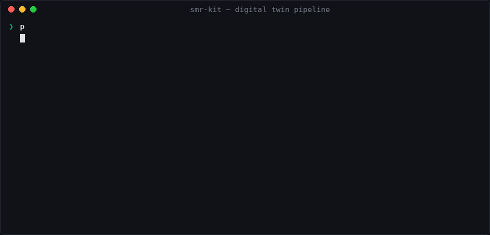
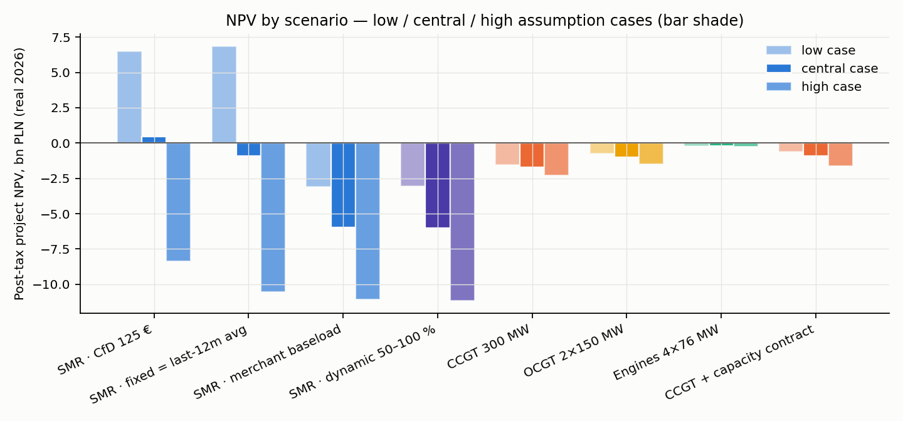
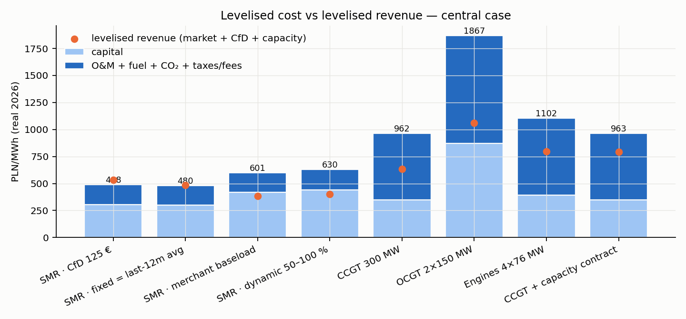
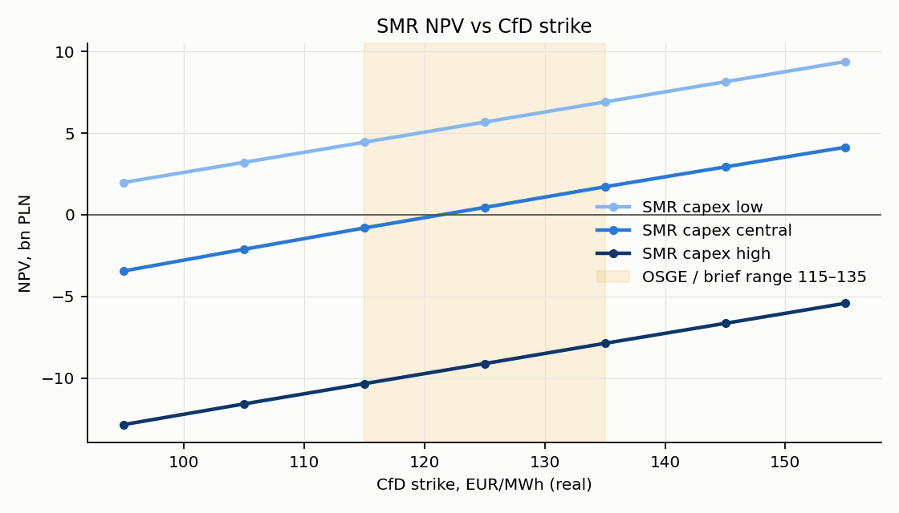
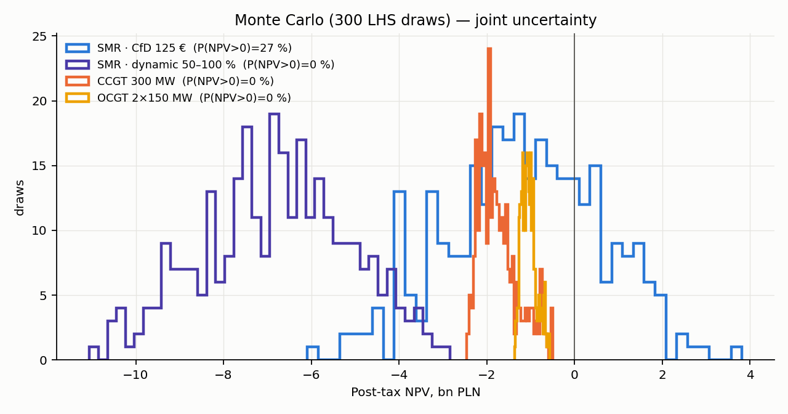
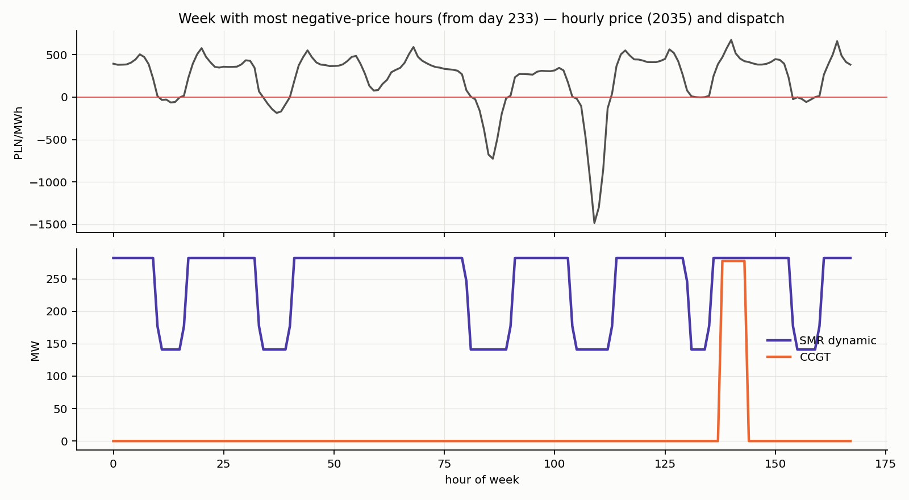
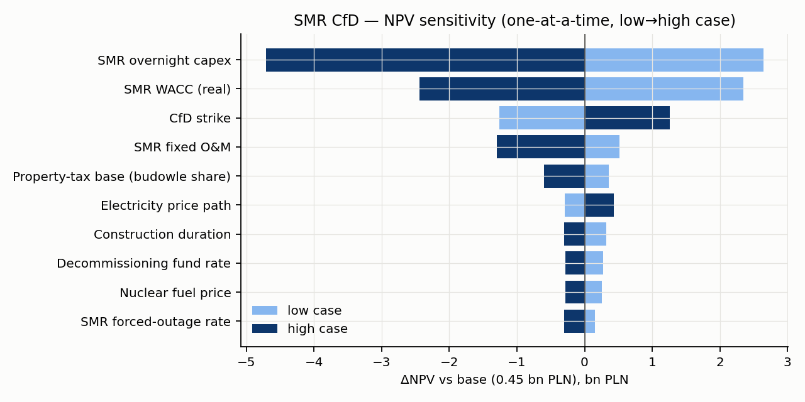
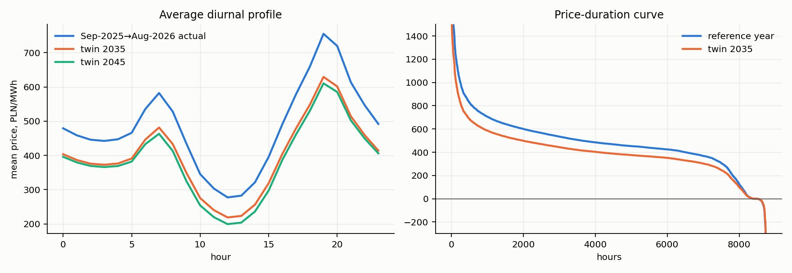
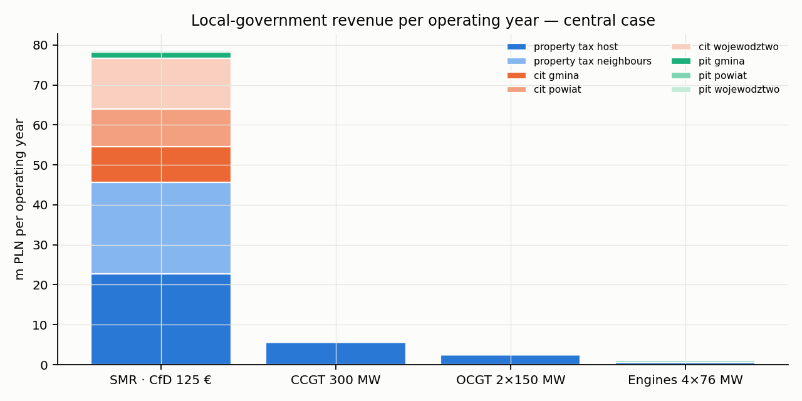
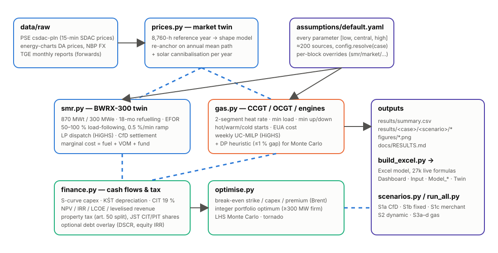

<p align="center">
  
</p>

<p align="center">
  <a href="#quick-start"></a>
  <a href="#-model-architecture"></a>
  <a href="#-the-digital-twin"></a>
  <a href="excel/"></a>
  <a href="tests/"></a>
  <a href="docs/research/"></a>
  
</p>

<p align="center">
  <b>A techno-economic digital twin that answers one question with two instruments:</b><br>
  <i>Given real Polish hourly prices, what does a 300 MWe BWRX-300 earn and cost under a CfD / fixed price / merchant dynamic dispatch — versus gas plants dispatched dynamically — and what support does each need to break even?</i>
</p>

<p align="center">
  
</p>

---

## ✨ Highlights

| | |
|---|---|
| 🔌 **Real market twin** | 8,760-hour reference year built from PSE SDAC 15-minute prices (Sep 2025 → Aug 2026: mean 483 PLN/MWh, 311 negative hours), re-anchored on a forward-based price path with growing solar cannibalisation — every model year gets its own hourly vector |
| ⚛️ **BWRX-300 physics** | 870 MWt / 300 MWe, 18-month refuelling, EFOR, 50–100 % load-following at the licensed 0.5 %/min, part-load efficiency, fuel/VOM/statutory-fund marginal cost, perfect-foresight LP dispatch, PEJ-template two-way CfD settlement |
| 🔥 **Gas unit commitment** | CCGT / OCGT / engines with two-segment heat-rate curves, min load, min up/down, hot-warm-cold starts, EUA cost — weekly MILPs (HiGHS) plus a DP heuristic validated to ≤ 1 % for Monte Carlo |
| 🧾 **Polish finance & tax** | Real-PLN cash flows, S-curve capex, KŚT depreciation (reactor 14 %), CIT with loss rules, property tax with the art. 50 nuclear split, 2025 JST CIT/PIT income shares, licence fees, decommissioning fund |
| 🎯 **Mathematical optimum** | Brent root-finding for break-even strike / capex / premium / capacity payment, integer portfolio optimum for ≥ 300 MW firm, 300-draw Latin-hypercube Monte Carlo, tornado |
| 📊 **Excel twin of the twin** | `build_excel.py` writes a 27k-formula workbook (Dashboard → Input LOW/CENTRAL/HIGH switch → six model sheets → Twin) that reconciles with Python to < 1 % on LCOE |
| 📚 **Every number sourced** | ~200 sources in `docs/research/`, each with URL, year and confidence grade; assumptions live in one YAML as `[low, central, high]` triplets |

---

## 📈 Headline results

<sub>Central case · real PLN 2026 · one 300 MWe unit at Stalowa Wola, COD 2035, 60-year life · gas COD 2031, 30-year life. Full discussion in [`docs/RESULTS.md`](docs/RESULTS.md).</sub>

| Scenario | NPV post-tax | IRR | LCOE | Lev. revenue | CF | Support needed for NPV = 0 |
|---|---:|---:|---:|---:|---:|---|
| **S1a** SMR · two-way CfD 125 €/MWh (40 y) | **+0.45 bn** | 5.2 % | 488 | 534 | 91 % | break-even strike **121 €/MWh** |
| **S1b** SMR · fixed = last-12-month spot avg (483 PLN) | −0.90 bn | 4.6 % | 480 | 483 | 94 % | +27 PLN/MWh |
| **S1c** SMR · merchant baseload | −5.99 bn | 2.7 % | 601 | 385 | 94 % | +265 PLN/MWh |
| **S2** SMR · merchant, dynamic 50–100 % | −6.02 bn | 2.7 % | 630 | 402 | 89 % | +280 PLN/MWh |
| **S3a** CCGT ~300 MW · merchant dynamic | −1.74 bn | n/a | 962 | 633 | 17 % | +372 PLN/MWh or **881 PLN/kW-yr** (15 y) |
| **S3b** OCGT 2×150 MW | −1.01 bn | n/a | 1,867 | 1,061 | 4 % | 441 PLN/kW-yr (15 y) |
| **S3c** Gas engines 4×76.5 MW | −0.22 bn | n/a | 1,102 | 797 | 10 % | 415 PLN/kW-yr (15 y) |
| **S3d** CCGT + 400 PLN/kW-yr capacity contract | −0.92 bn | n/a | 963 | 791 | 17 % | +215 PLN/MWh |

<table>
<tr>
<td width="50%"></td>
<td width="50%"></td>
</tr>
<tr>
<td></td>
<td></td>
</tr>
<tr>
<td></td>
<td></td>
</tr>
<tr>
<td></td>
<td></td>
</tr>
</table>

**Five findings, one line each**

1. **The 115–135 €/MWh CfD band fits a mid-fleet unit (38,000 PLN/kW ≈ 8,700 €/kW) at a 5 % real WACC and nothing else** — break-even 121 €/MWh; a Darlington-cost unit (55,000 PLN/kW) needs ~201 €/MWh, an OSGE-cost unit (28,000) breaks even at ~80 €/MWh. Capex and WACC are ~60 % of the total sensitivity swing; Monte Carlo P(NPV > 0) = 27 %.
2. **Dynamic 50–100 % dispatch does not rescue a merchant SMR**: ~5–8 m PLN/yr of arbitrage (≈ 520 h/yr below its 59 PLN/MWh marginal cost) is eaten by the 1.2 % load-following capability loss. The plant is a baseload asset; flexibility is insurance against negative prices, not a business.
3. **A merchant SMR loses ~6 bn PLN** because the Polish baseload capture price (≈ 385 PLN/MWh, drifting down with solar) is far below its 600 PLN/MWh LCOE — the CfD is the business, not a top-up.
4. **Merchant gas at 300 MW scale does not work either**: a new CCGT runs 33 % → 14 % of hours as EUA rises and needs ~880 PLN/kW-yr for 15 years, 1.9× the 2030 capacity-auction price. Peakers are the cheapest *firm capacity* (415–440 PLN/kW-yr) but deliver 4–10 % CF — a substitute for the SMR's firmness, not its 2.4 TWh/yr.
5. **Fiscal view**: the SMR's CfD costs the state ≈ 5.5 bn PLN (PV) over 40 years for 142 TWh of carbon-free baseload; the CCGT pays ≈ 3.0 bn PLN of EUAs (state auction revenue) for 15 TWh. Local government: ≈ 79 m PLN/yr from the SMR (46 m property tax, split 50/50 with bordering gminas) vs ≈ 6 m from the CCGT.

---

## 🚀 Quick start

```bash
git clone https://github.com/mvishiu11/smr-kit.git && cd smr-kit
pip install -r requirements.txt

python -m pytest tests                    # 5 smoke tests, ~3 s
python run_all.py --mc 300                # ≈ 12 min: all scenarios × cases, break-evens, MC, figures
python build_excel.py                     # regenerate the Excel model from YAML + results/
python run_all.py --figures-only          # redraw figures from saved results
```

Optional (≈ 55 MB, PSE open API + energy-charts + NBP; processed reference years are already committed):

```bash
python -m smrtwin.data.download && python -m smrtwin.prices
```

---

## 🧑‍💻 Usage examples

**1. One scenario, one line of assumptions**

```python
from smrtwin import config, scenarios as sc

a  = config.resolve(config.load_raw(), "central")          # every parameter at its central value
mt = sc.MarketTwin(a)                                       # hourly price / gas / EUA twin
r  = sc.run_scenario("S1a_smr_cfd", a, mt)                  # 60 operating years, LP dispatch each

k = r["kpis"]
print(f"NPV {k['npv_project_posttax_mpln']:.0f} m PLN, IRR {k['irr_project_posttax']:.1%}, "
      f"LCOE {k['lcoe_pln_per_mwh']:.0f} PLN/MWh, CF {k['avg_capacity_factor']:.1%}")
# NPV 449 m PLN, IRR 5.2%, LCOE 488 PLN/MWh, CF 91.2%
```

**2. Mix cases per block and edit single parameters**

```python
a = config.resolve(config.load_raw(), "central",
                   overrides={"smr": "high", "market": "low"},          # FOAK capex, weak prices
                   edits={"smr.cfd.strike_eur_per_mwh": 140,
                          "macro.wacc_real.smr_cfd": 0.045})
mt = sc.MarketTwin(a)
sc.run_scenario("S1a_smr_cfd", a, mt)["kpis"]["npv_project_posttax_mpln"]
```

**3. What strike / capex breaks even?**

```python
from smrtwin import optimise as op

op.breakeven_strike(a, mt, r)
# {'breakeven_strike_eur': 121.4, 'breakeven_capex_pln_per_kw': 39678, 'uplift_pln_per_mwh': -14.3, ...}

op.required_support(sc.run_scenario("S3a_gas_ccgt", a, mt), a)
# {'required_premium_pln_per_mwh': 372, 'required_capacity_payment_15yr_pln_per_kw_yr': 881, ...}
```

**4. Look inside the hourly dispatch**

```python
import numpy as np
from smrtwin import smr, prices

sm    = prices.shape_model(prices.reference_year("last12m"))
p     = prices.price_year(sm, annual_mean=410.0, extra_midday_depression=0.10)   # 8,760 h
unit  = sc.smr_unit(a)
avail = smr.availability_profile(year_index=0)                                    # refuelling + EFOR
d     = smr.dispatch_flexible(unit, p, avail)                                     # LP, ~0.1 s
print(d.capture_price, d.hours_at_min, d.curtailed_mwh)       # 426 PLN/MWh, 471 h, 85 GWh

from smrtwin import gas
spec, units = sc.gas_spec(a, "ccgt")
g = gas.dispatch_portfolio(units, p, mt.gas_price(2035), mt.eua_pln(2035))       # weekly MILPs, ~1 s
print(g.capture_price, g.starts, g.energy_mwh / (300 * 8760))
```

**5. Monte Carlo & tornado**

```python
mc  = op.monte_carlo(config.load_raw(), n=300)                # LHS over capex, delay, prices, gas, EUA, EFOR, WACC, O&M
tor = op.tornado(config.load_raw(), "S1a_smr_cfd", op.TORNADO)
print((mc["npv_S1a_smr_cfd"] > 0).mean(), tor.head(3))
```

**6. Portfolio optimum for ≥ 300 MW firm capacity**

```python
units = {k: sc.run_scenario(n, a, mt) for k, n in
         {"smr": "S1c_smr_merchant_baseload", "ccgt": "S3a_gas_ccgt",
          "ocgt": "S3b_gas_ocgt", "engine": "S3c_gas_engines"}.items()}
op.portfolio_optimum(a, mt, units, capacity_payment_pln_per_kw_yr=465.02).head()
```

---

## 🏗 Model architecture

<p align="center"></p>

```
smr-kit/
├── smrtwin/
│   ├── assumptions/default.yaml   every parameter as [low, central, high] + source note
│   ├── config.py                  resolve(case, overrides, edits) → scalar assumption dict
│   ├── prices.py                  hourly market twin (reference year, shape model, future years)
│   ├── smr.py                     BWRX-300 twin: availability, part-load, LP dispatch, CfD settlement
│   ├── gas.py                     CCGT/OCGT/engine twin: UC-MILP + DP heuristic
│   ├── finance.py                 cash flows, Polish tax, NPV/IRR/LCOE, local-government revenue
│   ├── scenarios.py               S1a/S1b/S1c/S2/S3a–d and the year-by-year loop
│   ├── optimise.py                break-evens, portfolio optimum, Monte Carlo, tornado
│   └── data/download.py           PSE / energy-charts / NBP fetchers
├── run_all.py                     end-to-end pipeline → results/, figures/
├── build_excel.py                 Excel model generator
├── excel/                         SMR_vs_Alternatives_Financial_Model.xlsx
├── results/                       summary.csv, per-case/per-scenario cash flows, MC, tornado, portfolios
├── figures/                       fig1–fig9
├── docs/
│   ├── METHODOLOGY.md · RESULTS.md · ASSUMPTIONS.md
│   └── research/                  01 SMR costs · 02 gas plants · 03 Polish market/CfD/tax (≈200 sources)
├── data/processed/                8,760-h reference years (committed); data/raw re-downloadable
└── tests/                         pytest smoke tests
```

### Scenario definitions

| ID | Asset | Revenue | Dispatch |
|---|---|---|---|
| `S1a_smr_cfd` | BWRX-300 | Two-way CfD, strike 115/125/135 €, 40-y tenor then merchant; daily TGeBase reference (PEJ template) | LP on the CfD-effective price; never below variable cost |
| `S1b_smr_fixed_spotavg` | BWRX-300 | Fixed real price for life = last-12-month spot mean | must-run |
| `S1c_smr_merchant_baseload` | BWRX-300 | Merchant | must-run (comparator) |
| `S2_smr_dynamic` | BWRX-300 | Merchant | LP load-following 50–100 %, 105 MW/h ramp |
| `S3a_gas_ccgt` | CCGT 1+1 ~300 MW | Merchant + balancing | weekly UC-MILP, min load 40 % |
| `S3b_gas_ocgt` | 2 × 150 MW OCGT | Merchant + balancing | UC-MILP, min load 30 % |
| `S3c_gas_engines` | 4 × 76.5 MW engine blocks | Merchant + balancing | UC-MILP, min load 10 % |
| `S3d_gas_ccgt_capmarket` | CCGT | + 15-y capacity contract (successor mechanism) | as S3a |

### Reading "alternative cost"

For a price-taker, **NPV = PV(value of output at market prices) − PV(all costs)** — i.e. minus the net cost to the system of building the asset instead of buying the same MWh from the market. The break-even support figures (strike, PLN/MWh premium, PLN/kW-yr) are the explicit price of each alternative.

---

## 🗂 Data provenance

| Data | Source | Used for |
|---|---|---|
| Hourly day-ahead prices PL | [PSE open API `csdac-pln`](https://api.raporty.pse.pl/) (15-min from 1 Oct 2025) chained with [energy-charts.info](https://energy-charts.info) × [NBP](https://api.nbp.pl) FX for 2019–Jun 2024 | reference year, shape model, negative-hour statistics |
| Forwards | TGE monthly reports Jan 2025 – Aug 2026 (BASE_Y-27/28/29 = 495.5 / 444.5 / 420.1 PLN/MWh) | 2027–29 annual means |
| Nuclear costs | OPG OEB filing EB-2025-0297 (Darlington unit-1 decomposition), MIT ANP-TR-201, INL 2023/24, NREL ATB 2025, EIA AEO2025, Lazard v18/v19, IAEA ARIS, GE Vernova | capex, O&M, schedule, fuel, flexibility |
| Gas costs | Polish EPC contracts 2020–2025 (Dolna Odra, Rybnik, Grudziądz, Ostrołęka, Adamów, Kozienice, Gdańsk), EIA, Lazard, DESNZ 2025, GridLab, Wood Mackenzie | capex, efficiency, starts, LTSA |
| Polish law & market | Prawo atomowe, Dz.U. 2012 poz. 1213 (17.16 PLN/MWh fund), EC decision OJ C 2025/1389 (PEJ CfD), URE capacity auctions, Dz.U. 2025 poz. 1066 (KWD), ustawa o dochodach JST, KŚT, KOBiZE, Gaz-System tariffs | CfD design, tax, local revenue, CO2, gas transport |

Full citations with URL, year and confidence grade: [`docs/research/`](docs/research/).

---

## ⚠️ Known limitations — read before quoting numbers

* **Price-taker**: 300–600 MW of new capacity does not move Polish prices. A gas-indexed price mode (`market.srmc_link`) exists for sensitivity; the base path deliberately decouples from gas after 2030.
* **Long-run price path (2030+) is judgement** bridging TGE 2029 forwards and the PEJ counterfactual — no official Polish curve (KPEiK/PSE) was obtainable. After capex and WACC it is the largest driver.
* **CfD design is inferred from the PEJ template**; OSGE's terms are undisclosed. The brief's 115–135 €/MWh range was not found in public OSGE statements (they quote 125–145).
* **No BWRX-300 has operated**: O&M, availability and load-following costs are benchmark proxies with wide ranges.
* **Perfect foresight** overstates gas margins by a few percent versus real day-ahead bidding.
* **Excel vs Python**: the workbook uses a simplified loss-carry-forward pool and an analytic S-curve; Python is the reference implementation (< 1 % on LCOE, ≈ 50 m PLN on the CfD NPV).

---

## 🧪 Reproducibility & testing

* `python -m pytest tests` — reference-year integrity, mean preservation of the shape model, flexible ≥ baseload margin, heuristic-vs-MILP gap < 3 %, finance identities.
* `run_all.py` is deterministic (LHS seed 7); MILPs use `mip_rel_gap 1e-4`.
* Regenerate README assets with `python docs/assets/make_assets.py`.

## 📖 Citation

> AM R&D sp. z o.o. (EnergyScope), *smr-kit: a digital-twin feasibility model for BWRX-300 SMR deployment at Stalowa Wola versus gas alternatives on the Polish power market*, 2026. https://github.com/mvishiu11/smr-kit

<p align="center"><sub>Built for the SMR research track of AM R&D / EnergyScope, Warsaw · Money in real PLN 2026 · FX NBP 18 Sep 2026</sub></p>
