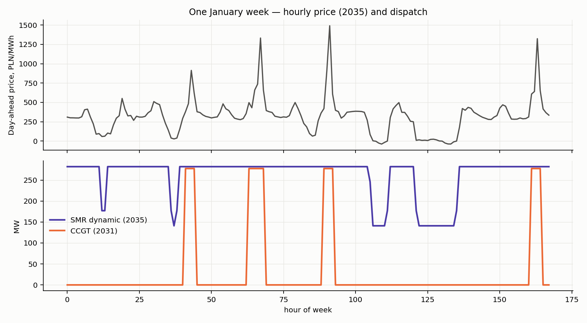

# Results and findings

All values real PLN at 2026 prices; one 300 MWe BWRX-300 unit at Stalowa Wola, COD 2035, 60-year life;
gas plants COD 2031, 30-year life. "Central" = every parameter at its central value. Full tables:
`results/summary.csv` (24 case × scenario rows + 18 cross-case rows), `results/<case>/<scenario>/`.

## 1. Scenario comparison

| Central case | NPV (m PLN) | IRR | LCOE | Lev. revenue | CF | Capture price | Support for NPV=0 |
|---|---|---|---|---|---|---|---|
| S1a SMR CfD 125 € | +449 | 5.2 % | 488 | 534 | 91 % | 387 (market leg) | strike 121 €/MWh |
| S1b SMR fixed 483 PLN | −896 | 4.6 % | 480 | 483 | 94 % | 483 | +27 PLN/MWh |
| S1c SMR merchant baseload | −5,995 | 2.7 % | 601 | 385 | 94 % | 381 | +265 PLN/MWh |
| S2 SMR dynamic | −6,015 | 2.7 % | 630 | 402 | 89 % | 397 | +280 PLN/MWh |
| S3a CCGT | −1,737 | <0 | 962 (749 ex-CO2) | 633 | 17 % | 639 | +372 PLN/MWh / 881 PLN/kW-yr |
| S3b OCGT 2×150 | −1,010 | <0 | 1,867 | 1,061 | 3.7 % | 961 | 441 PLN/kW-yr |
| S3c Engines 4×76.5 | −224 | <0 | 1,102 | 797 | 9.7 % | 766 | 415 PLN/kW-yr |
| S3d CCGT + 400 PLN/kW-yr | −925 | <0 | 963 | 791 | 17 % | 639 | +215 PLN/MWh |

SMR LCOE build-up (central, PLN/MWh, PV-weighted): capital 304, fixed O&M ≈ 70, fuel 31, fund 26,
sustaining 25, VOM 11, property tax ≈ 20, licence fee 2.5 → 488. Annual opex in operation ≈ 435 m PLN
(fixed O&M 161, fuel 74, fund 62, sustaining 59, property tax 46, VOM 26, licence 6).

### Across cases (all-low / all-central / all-high)

| Scenario | LOW (cheap SMR, low prices, 4 % WACC) | CENTRAL | HIGH (FOAK SMR, high prices, 6.5 % WACC) |
|---|---|---|---|
| S1a SMR CfD (115/125/135 €) | +6,476 | +449 | −8,388 |
| S1b SMR fixed 483 | +6,825 | −896 | −10,543 |
| S2 SMR dynamic | −3,029 | −6,015 | −11,165 |
| S3a CCGT | −1,528 | −1,737 | −2,313 |
| S3b OCGT | −726 | −1,010 | −1,516 |
| Break-even CfD strike (€/MWh) | 72 | 121 | 228 |
| Break-even overnight capex at the case strike (PLN/kW) | 53,700 | 39,700 | 24,000 |

Holding the market central and varying only SMR cost: 28,000 PLN/kW → 80 €/MWh; 38,000 → 121; 55,000 → 201.

## 2. Findings

**F1 — The CfD band 115–135 €/MWh is consistent with a mid-fleet unit at a 5 % real WACC, and with nothing
else.** Break-even is 121 €/MWh at 38,000 PLN/kW (≈ 8,700 €/kW all-in overnight). The band cannot carry
a Darlington-cost unit (55,000 PLN/kW needs ~200 €/MWh) and would over-reward an OSGE-cost unit
(28,000 PLN/kW breaks even at ~80 €/MWh — NPV +4.4 bn at 115 €). Because Stalowa Wola is OSGE's third/fourth
site, the fleet position (units 7–14) is what makes the mid-fleet cost defensible; the CfD is in effect a
bet on learning between Włocławek and Stalowa Wola. Tornado: capex swing 7.4 bn, WACC 4.8 bn, strike 2.5 bn,
fixed O&M 1.8 bn, property-tax base 1.0 bn, price path 0.7 bn (`figures/fig6_tornado_smr_cfd.png`).
Monte Carlo correlation of NPV with capex multiplier −0.83, WACC −0.50; P(NPV>0) = 27 %, p5/p50/p95 =
−4.0 / −1.2 / +1.6 bn PLN — the distribution is skewed negative because cost overrun risk is asymmetric.

**F2 — A merchant SMR is not investable, with or without flexibility.** Baseload capture price ≈ 381
PLN/MWh (0.93 × annual mean, drifting down with solar cannibalisation) against a 601 PLN/MWh LCOE →
NPV −6.0 bn, IRR 2.7 %. Dynamic 50–100 % dispatch (S2) raises the capture price to 397 but lowers
output by 5 pp and adds capability loss + O&M uplift: NPV −6.0 bn, i.e. the same. Decomposition
(central, per year): arbitrage gain from running at 50 % in ≈ 520 hours below marginal cost ≈ +5–8 m PLN;
1.2 % capability loss ≈ −11 m; 1 % O&M uplift ≈ −1.6 m. Flexibility only becomes valuable if negative
hours multiply well beyond the 300–500/yr modelled and if the capability loss can be avoided — physically
the BWRX-300's 0.5 %/min ramp (85 min for 50→100 %) also limits how much of a short trough it can dodge.
The plant's rational use of flexibility is defensive (avoid paying to generate), which the CfD dispatch
rule (never offer below variable cost) already captures.

**F3 — The fixed-price ("last-year average spot") case is the most instructive counterfactual.** At
483 PLN/MWh (111 €/MWh) for 60 years the SMR is only 27 PLN/MWh short of break-even at 5 % WACC — the
Sep-2025→Aug-2026 year, inflated by the 2026 gas shock, is close to the price a mid-fleet SMR needs.
A CfD at 125 € is therefore ≈ a 15 % premium over a crisis-year average, but ≈ 40 % over the market's own
forward view for 2029 (420 PLN/MWh) and ≈ 45 % over the modelled long-run baseload capture price.

**F4 — Gas is not a cheaper way to get the same product.** A 300 MW CCGT dispatched optimally against the
hourly twin runs 33 % of hours in 2031 falling to 14 % by 2040 (SRMC 437 → 483 PLN/MWh as EUA rises;
capture 577 → 660). Its LCOE (962 PLN/MWh; 749 without CO2) is dominated by low utilisation, and it needs
a capacity payment of ≈ 880 PLN/kW-yr for 15 years — 1.9× the 2030 auction clearing price (465) — or a
+372 PLN/MWh premium on every MWh. Larger units (560–880 MW, 4,800–5,500 PLN/kW, 61–64 %) would do
better, which is exactly why Poland's 2025 CCGTs came with 17-year capacity contracts. OCGT and engine
peakers are the cheapest *firm capacity* (415–440 PLN/kW-yr for 15 years, close to the auction price) but
deliver 4–10 % capacity factors: they are a substitute for the SMR's firmness, not for its 2.4 TWh/yr.

**F5 — Portfolio optimum for "≥ 300 MW firm".** Merchant: 1×OCGT-pair + 1–2 engine blocks, net cost
≈ 3.5 m PLN per firm MW (PV) versus 5.3–5.7 for CCGT-based and 15.5 for SMR-based portfolios. With a
465 PLN/kW-yr successor capacity mechanism the peaker portfolios are near break-even (−0.1 bn) and the
SMR-based one −5.3 bn. The SMR wins only on the energy axis: 150 TWh over life with 1.3 Mt CO2 (from
engines in the same portfolio) versus 6 TWh / 2.8 Mt for the peaker portfolio. The correct comparison
for the SMR is therefore CfD cost per MWh versus the market: ≈ 148 PLN/MWh net CfD cost (5.5 bn PLN PV
over 40 years / 37 TWh PV) buys carbon-free baseload at 534 PLN/MWh levelised, versus a CCGT at 962.

**F6 — Fiscal and local view.** Over life the SMR pays ≈ 6.3 bn PLN CIT (undiscounted) and 3.7 bn to
the decommissioning fund and receives 15.9 bn in CfD top-ups (PV 5.5 bn). The CCGT pays ≈ 3.0 bn PLN
for EUAs (Poland auctions its own allowances, so this is largely a fiscal transfer, not a cost to the
country) and no CIT. Local government: SMR ≈ 78.8 m PLN/yr (property tax 45.6 m — 22.8 m to Stalowa
Wola, 22.8 m to bordering gminas under art. 50; CIT-income shares ≈ 30 m once taxable; PIT shares
≈ 3 m from 180 staff), versus ≈ 6 m PLN/yr for the CCGT and 1–3 m for peakers. The property-tax base
(8–40 % of capex as *budowle* under the 2025 definitions) is the largest local uncertainty — and, at
1.0 bn PLN of NPV swing, a material project risk.

## 3. Dispatch behaviour (digital-twin evidence)

* The SMR runs flat except in the negative/near-zero midday hours, where it ramps to 50 % at the
  licensed 0.5 %/min and back. Hours at minimum load: 471–520 per year in 2035, rising with cannibalisation.
* The CCGT commits for evening peaks and winter days only; 160–200 starts per year (mostly warm),
  which is why start-up wear (≈ 3 PLN/MWh) and the two-segment heat-rate curve matter.
* Planned SMR outages in April coincide with the lowest-price month; the twin captures this timing value
  (≈ 1–2 % of revenue).

## 4. Monte Carlo

| NPV, m PLN | p5 | p25 | p50 | p75 | p95 | P(NPV>0) |
|---|---|---|---|---|---|---|
| S1a SMR CfD | −4,030 | −2,245 | −1,172 | +97 | +1,609 | 27 % |
| S2 SMR dynamic | −9,607 | −7,890 | −6,765 | −5,638 | −4,092 | 0 % |
| S3a CCGT | −2,264 | −2,070 | −1,830 | −1,502 | −760 | 0 % |
| S3b OCGT | −1,268 | −1,171 | −1,058 | −938 | −686 | 0 % |

The MC median for the CfD case is below the central-case NPV because the capex distribution is skewed
upward (0.75–1.45, mode 1.0) and delays are one-sided — the honest reading of Darlington and of every
FOAK nuclear programme.

## 5. What would change the conclusions

1. **The actual OSGE/ME strike and tenor.** Each 10 €/MWh ≈ 1.25 bn PLN NPV (central).
2. **A Polish long-run price curve** (KPEiK/PSE) — the 2030+ path is judgement; the gas-indexed mode
   (`market.srmc_link.enabled`, mean = 0.95 × CCGT SRMC → 422 PLN/MWh in 2035, 436 from 2040) lifts the
   merchant SMR NPV from −6.0 to −4.9 bn and the CCGT from −1.7 to −1.4 bn (CF 31 %); nothing flips sign.
3. **Property-tax classification** of nuclear structures (8–40 % of capex).
4. **Multi-unit operation from day one** (fixed O&M ×1.5 single-unit penalty for 3 years ≈ 0.2 bn NPV).
5. **Direct-line supply to the Euro-Park** (retail-stack capture ≈ 585–640 PLN/MWh per the knowledge
   pack) — outside this model's scope but the obvious next scenario: it would lift the merchant capture
   price by ≈ 50 % and change F2.
